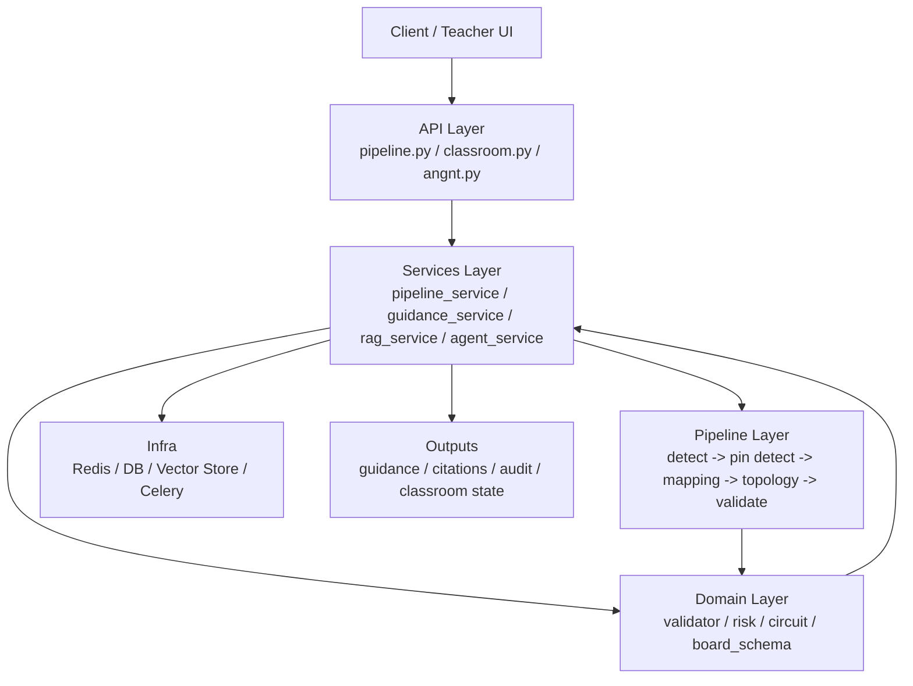

# Backend Architecture

这份文档用于回答两个团队协作里的核心问题：

1. 当前后端和视觉链到底按什么阶段工作？
2. 每一层、每个文件后续应该由谁改、怎么改，才不会把职责重新混回去？

## Current Snapshot

当前已经形成 4 条清晰主线：

- API / Service / Domain / Pipeline 分层已经基本建立
- 视觉链已经固定为 `S1 -> S1.5 -> S2 -> S3 -> S4`
- `topology_input.py` 已切换为只接受结构化 `components[].pins[]`
- 新 `netlist_v2 + validator_report_v2` 链路已经可以作为后续 guidance / RAG / agent 的正式基础
- `circuit.py` / `validator.py` 的主逻辑已切换到 `ComponentInstance`
- `ic_models.py` / `polarity.py` 已切换到 `ComponentInstance` 语义

## Stage-Oriented Workflow

当前推荐全团队都先按下面这条主线理解系统：

```text
输入图片(top / left / right)
-> S1 component detect
-> S1.5 component ROI pin detect
-> S2 hole mapping
-> S3 topology / netlist_v2
-> S4 validate / risk / validator_report_v2
```

### S1: Component Detect

对应文件:

- `app/pipeline/stages/s1_detect.py`
- `app/pipeline/vision/detector.py`

职责:

- 用 `top` 视图建立主实例
- 生成全局 `component_id`
- 输出 `component_type / package_type / pin_schema_id / bbox / orientation`
- 输出 `side recall candidates`

当前协作约束:

- S1 不再负责 pin 推断
- side detection 目前只做候选补召回, 不直接进入主实例列表
- 真实 `YOLO-OBB` 模型后续主要接在 `detector.py`

### S1.5: Component ROI Pin Detect

对应文件:

- `app/pipeline/stages/s1b_pin_detect.py`
- `app/pipeline/vision/pin_model.py`
- `app/pipeline/vision/roi_cropper.py`
- `app/pipeline/vision/pin_schema.py`

职责:

- 根据 `component_id + bbox + package_type` 建立 ROI
- 对每个视图分别执行 pin detector
- 输出 ordered `pins[]`
- 保留多视图 pin 证据:
  - `keypoints_by_view`
  - `visibility_by_view`
  - `score_by_view`
  - `source_by_view`
  - `roi_by_view`

当前协作约束:

- `PinRoiDetector` 是 `YOLO-Pose` 的正式接入口
- 当前允许存在 `heuristic_fallback`, 但必须显式标记
- 侧视图 ROI 当前仍可能走 `shared_bbox_fallback`

### S2: Hole Mapping

对应文件:

- `app/pipeline/stages/s2_mapping.py`
- `app/pipeline/vision/calibrator.py`
- `app/pipeline/vision/image_io.py`

职责:

- 使用校准器把 pin keypoint 映射到 `hole_id`
- 进一步映射到 `electrical_node_id`
- 生成:
  - `candidate_hole_ids`
  - `candidate_node_ids`
  - `observations`
  - `is_ambiguous`
  - `ambiguity_reasons`
- 保留 decode / calibration / fallback 元数据

当前协作约束:

- S2 不再负责从 bbox 猜 pin
- 新逻辑优先增强多视图融合和证据质量, 而不是重新引入旧 pin 推断

### S3: Topology / Netlist

对应文件:

- `app/pipeline/stages/s3_topology.py`
- `app/pipeline/topology_input.py`
- `app/domain/circuit.py`
- `app/domain/board_schema.py`

职责:

- 消费结构化 `components[].pins[]`
- 构建 `topology_graph`
- 导出 `netlist_v2`

当前协作约束:

- S3 默认语义固定为:

```text
component_id + pin_name + hole_id
-> electrical_node_id
-> electrical_net_id
```

- 不再接受旧 `pin1_logic / pin2_logic` 作为主输入

### S4: Validate / Risk

对应文件:

- `app/pipeline/stages/s4_validate.py`
- `app/domain/validator.py`
- `app/domain/risk.py`

职责:

- 与 `labguardian_ref_v4` 参考电路比较
- 输出 `validator_report_v2`
- 生成:
  - `error_code`
  - `suggested_action`
  - `evidence_refs`
  - `risk_level`
  - `risk_reasons`

当前协作约束:

- guidance / RAG / agent 后续都应优先消费这层结构化结果
- 新解释逻辑不应绕开 validator 直接从视觉结果“猜答案”

## Current Responsibility Boundaries

### `app/api`

职责:

- 暴露 HTTP / WebSocket 入口
- 做请求解析、响应组装、状态码控制
- 不承载核心业务推理

当前文件:

- `app/api/v1/pipeline.py`: pipeline 提交、查询、同步运行
- `app/api/v1/classroom.py`: heartbeat、课堂态势、指导推送
- `app/api/v1/angnt.py`: ask / status 入口
- `app/api/v1/websocket.py`: 学生端 WS 长连接

### `app/services`

职责:

- 编排跨模块业务流程
- 维护应用态状态与会话
- 处理缓存、审计、通知、RAG 编排等“应用服务”

当前文件:

- `app/services/classroom_state.py`: 课堂实时状态与 websocket 注册表
- `app/services/guidance_service.py`: 指导下发、广播、审计
- `app/services/pipeline_service.py`: pipeline 结果归档、幂等与结果复用
- `app/services/rag_service.py`: 检索编排、上下文压缩、citation 生成
- `app/services/agent_service.py`: agent 任务调度、工具路由、动作执行
- `app/services/version_service.py`: code/model/kb/rule 版本对外暴露

### `app/domain`

职责:

- 承载稳定的业务规则与核心领域对象
- 不依赖 FastAPI / Celery / Redis 等框架细节
- 尽量保持“可离线测试”

当前文件:

- `app/domain/circuit.py`: 电路拓扑与网表建模
- `app/domain/validator.py`: 参考电路比较与诊断
- `app/domain/risk.py`: 风险分级
- `app/domain/polarity.py`: 极性推断
- `app/domain/ic_models.py`: 器件领域知识

### `app/pipeline`

职责:

- 承载视觉与分析流水线
- 输出结构化中间结果，供服务层和 agent 层复用
- 不直接耦合课堂态状态或前端协议

当前结构:

- `app/pipeline/orchestrator.py`: S1-S4 总调度
- `app/pipeline/stages/`: detect / pin detect / mapping / topology / validate
- `app/pipeline/vision/`: YOLO-OBB、YOLO-Pose 接口、校准、ROI、图像解码等底层视觉能力

建议约束:

- `pipeline` 只输出事实，不负责教学话术
- `pipeline` 输出必须可序列化、可版本化、可回放

## Recommended Layout

```text
app/
├── api/
│   └── v1/
│       ├── angnt.py
│       ├── classroom.py
│       ├── pipeline.py
│       └── websocket.py
├── core/
│   ├── config.py
│   ├── celery_app.py
│   ├── deps.py
│   ├── auth.py
│   └── observability.py
├── domain/
│   ├── circuit.py
│   ├── ic_models.py
│   ├── polarity.py
│   ├── risk.py
│   └── validator.py
├── pipeline/
│   ├── orchestrator.py
│   ├── stages/
│   └── vision/
├── services/
│   ├── agent_service.py
│   ├── classroom_state.py
│   ├── guidance_service.py
│   ├── pipeline_service.py
│   ├── rag_service.py
│   └── version_service.py
└── worker/
    └── tasks.py
```

## RAG / Agent Placement

### Why not put RAG inside `pipeline`

- `pipeline` 负责识别与分析事实
- RAG / agent 负责“如何解释事实、引用什么资料、是否触发动作”
- 两者生命周期、资源消耗和可替换性不同

### Recommended Flow



## Netlist Migration Landing

当前建议团队默认使用下面这条语义链理解服务器端电路结果：

```text
component_id + pin_name + hole_id
-> electrical_node_id
-> electrical_net_id
-> netlist_v2
-> validator_report_v2
```

对应落点:

- `app/pipeline/stages/s2_mapping.py`
  - 视觉结果到 `components[].pins[]`
- `app/pipeline/topology_input.py`
  - 旧/新结构归一化
- `app/domain/circuit.py`
  - `board_schema` 驱动建图与 `netlist_v2`
  - 拓扑图、文本描述、SPICE 导出优先围绕 `ComponentInstance`
- `app/domain/validator.py`
  - compare / diagnose / error code / evidence refs
  - 独立诊断优先消费 `ComponentInstance + pins[]`
- `app/domain/ic_models.py`
  - 只负责输出封装 pin 布局，不再返回旧内部组件对象
- `app/domain/polarity.py`
  - 只负责补充 `ComponentInstance` 极性信息

## Team Entry Points

如果团队成员要并行开发，推荐按下面入口分工：

### 接 `YOLO-OBB`

优先看:

- `app/pipeline/vision/detector.py`
- `app/pipeline/stages/s1_detect.py`

### 接 `YOLO-Pose`

优先看:

- `app/pipeline/vision/pin_model.py`
- `app/pipeline/stages/s1b_pin_detect.py`
- `app/pipeline/vision/pin_schema.py`

### 改 ROI / 多视图关联

优先看:

- `app/pipeline/vision/roi_cropper.py`
- `app/pipeline/stages/s1b_pin_detect.py`

### 改 hole mapping / calibrator

优先看:

- `app/pipeline/stages/s2_mapping.py`
- `app/pipeline/vision/calibrator.py`
- `app/pipeline/vision/image_io.py`

### 改 topology / netlist

优先看:

- `app/pipeline/topology_input.py`
- `app/domain/circuit.py`
- `app/domain/board_schema.py`

### 改 validator / guidance / agent

优先看:

- `app/domain/validator.py`
- `app/pipeline/stages/s4_validate.py`
- `app/services/guidance_service.py`
- `app/services/rag_service.py`
- `app/services/agent_service.py`

## Formal Agent Landing Design

### `angnt` input

- 用户问题
- `PipelineResult`
- `topology_graph`
- `netlist`
- `diagnostics`
- `risk_level` / `risk_reasons`
- 可选课堂上下文

### `services/rag_service.py`

职责:

- 检索知识库
- 拼接最小上下文
- 输出 citations
- 控制缓存与成本

### `services/agent_service.py`

职责:

- 判断是否需要检索
- 组织 ReAct / tool call 轨迹
- 将领域证据转换成可读指导
- 决定是否调用 `guidance_service` 下发动作

### `domain/evidence.py`

建议统一的证据结构:

- `evidence_type`: topology / netlist / risk_rule / kb_chunk / classroom_event
- `source_id`
- `version`
- `payload`
- `confidence`

## Boundary Rules

后续重构时建议强制遵守:

1. `api` 不直接操作 `_shared_ctx`、websocket 注册表或检索逻辑。
2. `services` 不写视觉算法细节，只编排和持久化。
3. `domain` 不 import FastAPI、Celery、Redis。
4. `pipeline` 不直接生成教师话术或 citation。
5. `agent` 只消费结构化证据，不绕开 validator/risk 直接“猜答案”。

6. `S1 / S1.5 / S2` 的 JSON 合同优先保持稳定，模型训练完成后尽量只替换推理内核。

7. fallback 必须显式标记来源，不伪装成真实模型输出。

## Collaboration Notes

为了降低多人并行修改时的冲突，建议默认这样分工：

- 视觉 / S1 / S2 团队
  - 重点维护 `app/pipeline/stages/s2_mapping.py`
  - 输出必须优先对齐 `components[].pins[]`
  - 同时维护 `s1_detect.py / s1b_pin_detect.py / detector.py / pin_model.py`
- 拓扑 / 网表团队
  - 重点维护 `app/pipeline/topology_input.py`、`app/domain/circuit.py`
  - 避免把 board 规则写回视觉阶段
- 检错 / 指导 / agent 团队
  - 重点维护 `app/domain/validator.py`、`app/services/*`
  - 新解释逻辑优先基于 `validator_report_v2`

## Current Gaps

为了让 README 和架构文档保持同一套认知，这里明确当前还未完成的点：

- `YOLO-Pose` 真实第二模型尚未正式接入, 当前仍允许 `heuristic_fallback`
- 侧视图 ROI 目前仍可能使用 `shared_bbox_fallback`
- side recall candidates 目前还没有完全接成“缺失实例补全”
- 比赛板实物若与默认 schema 有差异, 还需要补正式 schema JSON
