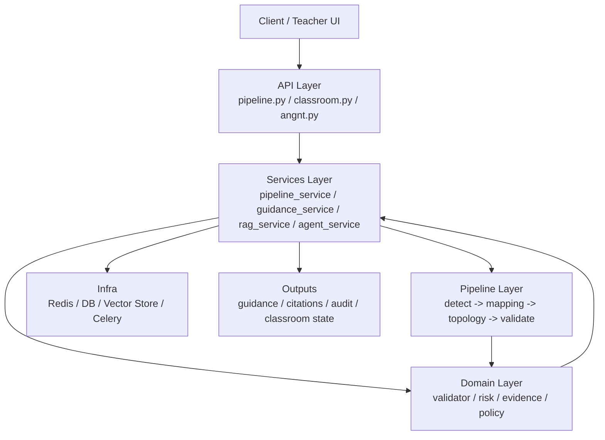

# Backend Architecture

这份文档用于回答“当前后端应该怎么理解分层和边界”，重点是帮助团队在继续迭代时避免把迁移中的职责再次混回去。

## Current Snapshot

当前已经形成 3 条清晰主线：

- API / Service / Domain / Pipeline 分层已经基本建立
- `topology_input.py` 已切换为只接受结构化 `components[].pins[]`
- 新 `netlist_v2 + validator_report_v2` 链路已经可以作为后续 guidance / RAG / agent 的正式基础
- `circuit.py` / `validator.py` 的主逻辑已切换到 `ComponentInstance`
- `ic_models.py` / `polarity.py` 已切换到 `ComponentInstance` 语义

## Current Responsibility Boundaries

### `app/api`

职责:

- 暴露 HTTP / WebSocket 入口
- 做请求解析、响应组装、状态码控制
- 不承载核心业务推理

当前文件:

- `app/api/v1/pipeline.py`: pipeline 提交、查询、同步运行
- `app/api/v1/classroom.py`: heartbeat、课堂态势、指导推送
- `app/api/v1/websocket.py`: 学生端 WS 长连接

建议扩展:

- 新增 `app/api/v1/angnt.py`: 统一承载 RAG / agent 的 ask、status、stream 入口

### `app/services`

职责:

- 编排跨模块业务流程
- 维护应用态状态与会话
- 处理缓存、审计、通知、RAG 编排等“应用服务”

当前文件:

- `app/services/classroom_state.py`: 课堂实时状态与 websocket 注册表

建议扩展:

- `app/services/guidance_service.py`: 指导下发、广播、审计
- `app/services/pipeline_service.py`: pipeline 结果归档、幂等与结果复用
- `app/services/rag_service.py`: 检索编排、上下文压缩、citation 生成
- `app/services/agent_service.py`: agent 任务调度、工具路由、动作执行
- `app/services/version_service.py`: code/model/kb/rule 版本对外暴露

### `app/domain`

职责:

- 承载稳定的业务规则与核心领域对象
- 不依赖 FastAPI / Celery / Redis 等框架细节
- 尽量保持“可离线测试”

当前文件:

- `app/domain/circuit.py`: 电路拓扑与网表建模
- `app/domain/validator.py`: 参考电路比较与诊断
- `app/domain/risk.py`: 风险分级
- `app/domain/polarity.py`: 极性推断
- `app/domain/ic_models.py`: 器件领域知识

建议扩展:

- `app/domain/evidence.py`: 结构化证据模型，如 topology/netlist/risk/diagnostic code
- `app/domain/guidance.py`: 指导消息、操作建议、引用片段等领域对象
- `app/domain/policy.py`: 教学规则、风险规则、agent 可执行动作白名单

### `app/pipeline`

职责:

- 承载视觉与分析流水线
- 输出结构化中间结果，供服务层和 agent 层复用
- 不直接耦合课堂态状态或前端协议

当前结构:

- `app/pipeline/orchestrator.py`: S1-S4 总调度
- `app/pipeline/stages/`: detect / mapping / topology / validate
- `app/pipeline/vision/`: YOLO、校准、导线、引脚等底层视觉能力

建议约束:

- `pipeline` 只输出事实，不负责教学话术
- `pipeline` 输出必须可序列化、可版本化、可回放

## Recommended Layout

```text
app/
├── api/
│   └── v1/
│       ├── angnt.py
│       ├── classroom.py
│       ├── pipeline.py
│       └── websocket.py
├── core/
│   ├── config.py
│   ├── celery_app.py
│   ├── deps.py
│   ├── auth.py
│   └── observability.py
├── domain/
│   ├── circuit.py
│   ├── evidence.py
│   ├── guidance.py
│   ├── ic_models.py
│   ├── polarity.py
│   ├── policy.py
│   ├── risk.py
│   └── validator.py
├── pipeline/
│   ├── orchestrator.py
│   ├── stages/
│   └── vision/
├── services/
│   ├── agent_service.py
│   ├── classroom_state.py
│   ├── guidance_service.py
│   ├── pipeline_service.py
│   ├── rag_service.py
│   └── version_service.py
└── worker/
    ├── tasks.py
    └── agent_tasks.py
```

## RAG / Agent Placement

### Why not put RAG inside `pipeline`

- `pipeline` 负责识别与分析事实
- RAG / agent 负责“如何解释事实、引用什么资料、是否触发动作”
- 两者生命周期、资源消耗和可替换性不同

### Recommended Flow



## Netlist Migration Landing

当前建议团队默认使用下面这条语义链理解服务器端电路结果：

```text
component_id + pin_name + hole_id
-> electrical_node_id
-> electrical_net_id
-> netlist_v2
-> validator_report_v2
```

对应落点：

- `app/pipeline/stages/s2_mapping.py`
  - 视觉结果到 `components[].pins[]`
- `app/pipeline/topology_input.py`
  - 旧/新结构归一化
- `app/domain/circuit.py`
  - `board_schema` 驱动建图与 `netlist_v2`
  - 拓扑图、文本描述、SPICE 导出优先围绕 `ComponentInstance`
- `app/domain/validator.py`
  - compare / diagnose / error code / evidence refs
  - 独立诊断优先消费 `ComponentInstance + pins[]`
- `app/domain/ic_models.py`
  - 只负责输出封装 pin 布局，不再返回旧内部组件对象
- `app/domain/polarity.py`
  - 只负责补充 `ComponentInstance` 极性信息

## Formal Agent Landing Design

### `angnt` input

- 用户问题
- `PipelineResult`
- `topology_graph`
- `netlist`
- `diagnostics`
- `risk_level` / `risk_reasons`
- 可选课堂上下文

### `services/rag_service.py`

职责:

- 检索知识库
- 拼接最小上下文
- 输出 citations
- 控制缓存与成本

### `services/agent_service.py`

职责:

- 判断是否需要检索
- 组织 ReAct / tool call 轨迹
- 将领域证据转换成可读指导
- 决定是否调用 `guidance_service` 下发动作

### `domain/evidence.py`

建议统一的证据结构:

- `evidence_type`: topology / netlist / risk_rule / kb_chunk / classroom_event
- `source_id`
- `version`
- `payload`
- `confidence`

## Boundary Rules

后续重构时建议强制遵守:

1. `api` 不直接操作 `_shared_ctx`、websocket 注册表或检索逻辑。
2. `services` 不写视觉算法细节，只编排和持久化。
3. `domain` 不 import FastAPI、Celery、Redis。
4. `pipeline` 不直接生成教师话术或 citation。
5. `agent` 只消费结构化证据，不绕开 validator/risk 直接“猜答案”。

## Collaboration Notes

为了降低多人并行修改时的冲突，建议默认这样分工：

- 视觉 / S1 / S2 团队
  - 重点维护 `app/pipeline/stages/s2_mapping.py`
  - 输出必须优先对齐 `components[].pins[]`
- 拓扑 / 网表团队
  - 重点维护 `app/pipeline/topology_input.py`、`app/domain/circuit.py`
  - 避免把 board 规则写回视觉阶段
- 检错 / 指导 / agent 团队
  - 重点维护 `app/domain/validator.py`、`app/services/*`
  - 新解释逻辑优先基于 `validator_report_v2`
